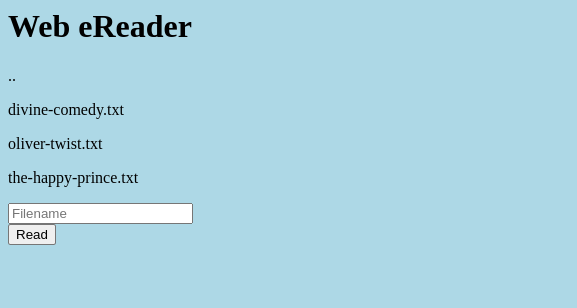
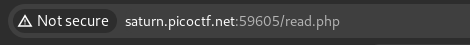
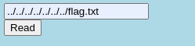
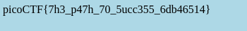

# Platform: PicoCTF
# Name: Forbidden_Paths

Following the link we get to this page:

Testing this online file reader we find out about a "php" page responsible with reading the files.

This looks like a Local File Inclusion (LFI) so I'll try to get to the root directory and then read the flag.

And it worked!

# We got the Flag!s