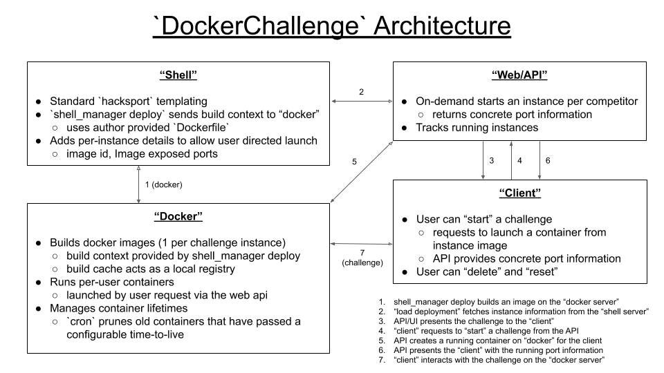
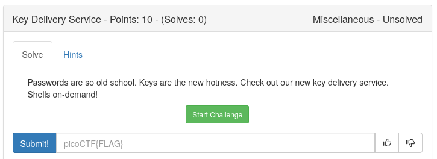
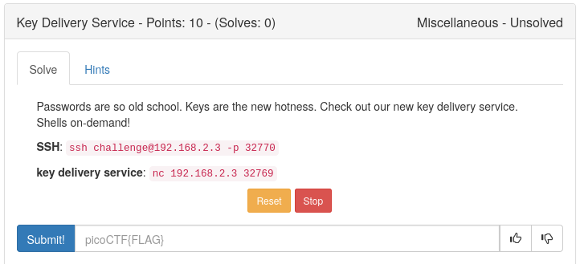

# On-Demand Challenges

**On-demand** challenges allow isolated, per-competitor, copies of a challenge
instance. This functionality is supported by the `DockerChallenge` class.

## Advantages

**Challenge isolation**. Every user gets a clean slate and their actions or
modifications will not impact other users. This enables stateful challenges
where a user can make modifications. It also allows more stable performance
characteristics as any given "on-demand" service only has a single user.
Importantly it prevents challenges from having unintentional lateral solutions.

**More complex constructions**. Since they are isolated per user the
`DockerChallenge` class allows arbitrarily complex challenge design, including
challenges with multiple related services.

**Greater development flexibility**. Anything that can be done in a container
a challenge authors can do without worrying about system wide conflicts.

**Challenge reset**. Every user can reset their on-demand challenges to a fresh
state. This can ease administration.

## Examples

The best way to learn how to use the `DockerChallenge` class is to consult the
provided [examples](../../problems/examples/on-demand/Readme.md)

## Architecture

The `DockerChallenge` class relies on access to a running `docker` daemon.  In
the development `Vagrantfile` this is configured to run on the shell server.
However in a production environment it can also be isolated to a separate
"docker server" with the daemon listening on a [TLS protected socket][dtls].
The provided `ansible` roles `docker` and `docker_tls` ensure that TLS is
appropriately configured in both cases. For clarity on the interface the
following diagrams show the "docker server" as a separate entity.

[dtls]:https://docs.docker.com/engine/security/https/

### DockerChallenge Lifetime

1. `shell_manager` deploy builds an image on the "docker server"
2. "load deployment" fetches instance information from the "shell server"
3. API/UI presents the challenge to the "client"
4. "client" requests to "start" a challenge from the API
5. API creates a running container on the "docker server" for the client
6. API presents the "client" with the running port information
7. "client" interacts with the challenge on the "docker server"

**Steps 1-3** are one time actions during challenge deployment similar to other
hacksport problem types. The only significant difference is that the
`DockerChallenge` class does not result in any service actually being started.

**Steps 4-7** are the "on-demand" functionality and can be repeated multiple times,
as a user desires.

The following screenshots show the user facing interaface for on-demand challenges.

#### Initial View (4)

#### Once Started (6)

## Limits

These limits are configurable, but by default a user is limited to running
3 on-demand challenges at a time and each on-demand challenge lasts for 1 hour.

## Configuration

The following variables can be used to configure the `ansible` deployment of the
platform. Consult  `ansible/group_vars/local_development` for an example

variable                    | description
----------------------------|--------------------
docker_public_host          | competitor facing hostname (or IP) used in challenge description
docker_internal_host        | connection URI to docker daemon
docker_server_SAN           | should include DNS and IP information for docker server
docker_ca                   | path to ca.pem
docker_client               | path to cert.pem
docker_key                  | path to key.pem
docker_ttl                  | time-to-live for a container
docker_containers_per_team  | number of concurrent on-demand instances

These are then templated into the API `deploy_settings.py` by the `pico-web`
role and `local_config.json` for `shell_manager` by the `pico-shell` role.

## Experimental: Containerized hacksport

The `DockerChallenge` infrastructure can also be leveraged to "lift" legacy
hacksport challenges into isolated, on-demand, containers.

This experimental functionality is provide by `shell_manager containerize` which
is intended as a drop in replacement for `shell_manager deploy`. The end result
is that instead of having the instance installed locally on the system it is
entirely contained within a docker container.

This functionality is primarily intended to test, evaluate, and preserve support
for legacy content. While many challenges will work without any modification,
challenge developer testing is critical to ensure that things operate as
expected.

## Limitations

- Commands that cannot be run during `docker build` such as `mount` will not
work.
- Description templating may not work as intended as the challenge is converted
to an on-demand style and the host/port are not accessible.
- Challenges that required local access (e.g. ssh into the shell server), will
not work as by default a user does not have access to the launched container
like they would on the shell server.

## Future

This experiment is intended to validate the feasibility of preserving support
for existing hacksport style challenges and challenge management architectures
such as [cmgr][].

This functionality is not recommended for production use unless you have
experience developing challenges with the `DockerChallenge` class, and are
comfortable troubleshooting a challenge port.

[cmgr]:https://github.com/ArmyCyberInstitute/cmgr
