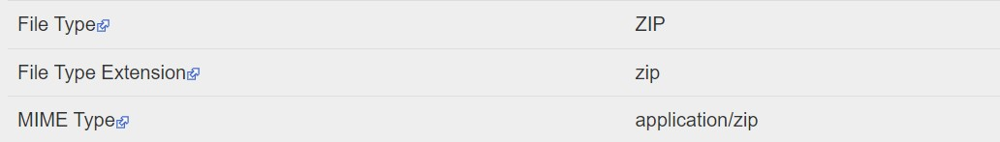
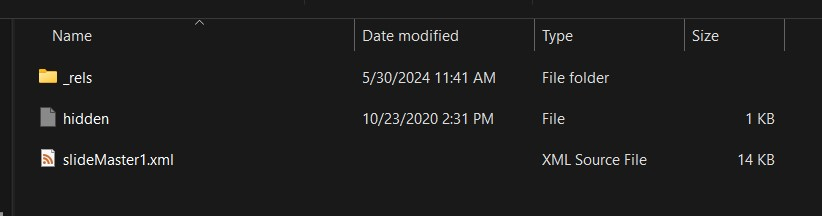
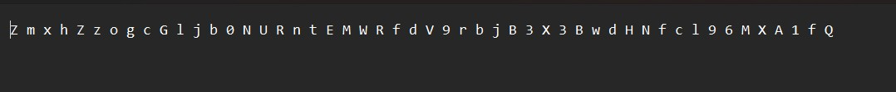
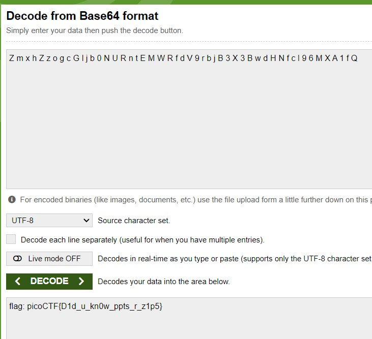

# MacroHard Weakedge

I've hidden a flag in this file. Can you find it? Forensics is fun.pptm

# Hints

no hints.

# What I Did

After i download the file i put it in exif tool,
based on this result i assume that this pptm file can
be extracted


I check each file inside it one by one, and the i find this suspicious
hidden file


It shows me random letters


then i try to decode it using base64 and it shows the flag


the flag is

``` 

picoCTF{D1d_u_kn0w_ppts_r_z1p5}

```
