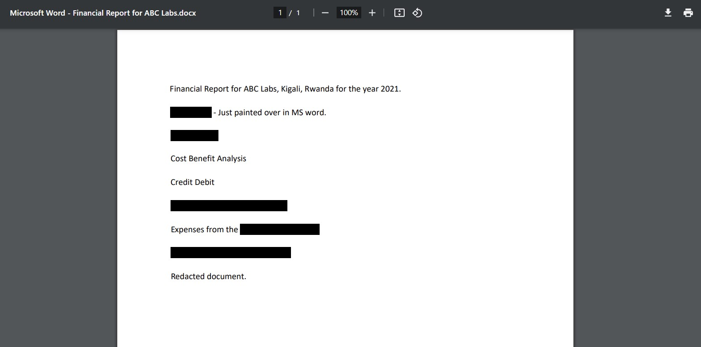
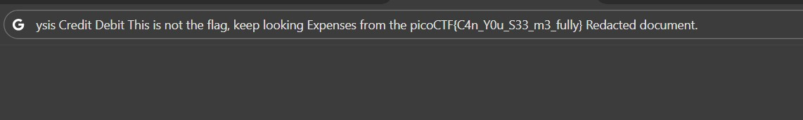

# Redaction gone wrong

Now you DON’T see me.
This report has some critical data in it, some of which have been redacted correctly, while some were not. Can you find an important key that was not redacted properly?

# Hints

1. How can you be sure of the redaction?

# What I Did

I download the file and see whats inside the file


I assume that i need to see the text that blocked with the black color,
so i just copy all the text and paste it somewhere (in my case its url bar),
and it shows me the flag


the flag is
``` 

picoCTF{C4n_Y0u_S33_m3_fully} 

```