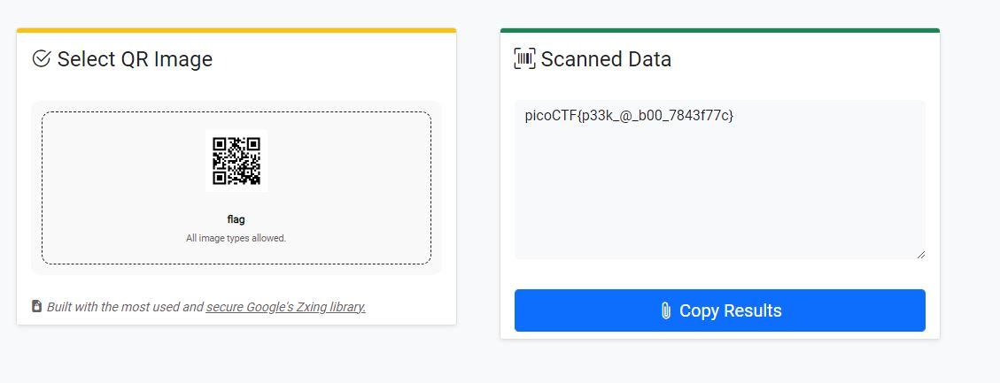

# Scan Surprise

I've gotten bored of handing out flags as text. Wouldn't it be cool if they were an image instead?
You can download the challenge files here:
challenge.zip
Additional details will be available after launching your challenge instance.

# Hints

1. QR codes are a way of encoding data. While they're most known for storing URLs, they can store other things too.
2. Mobile phones have included native QR code scanners in their cameras since version 8 (Oreo) and iOS 11
3. If you don't have access to a phone, you can also use zbar-tools to convert an image to text

# What I Did

I download the file and inside it there is a qr code, and i we just need to 
scan it to get the flag, i used online qr scanner since i am using pc
https://scanqr.org/#scan

and then i get the flag after i scan it


and the flag is
```

picoCTF{p33k_@_b00_7843f77c} 

```
