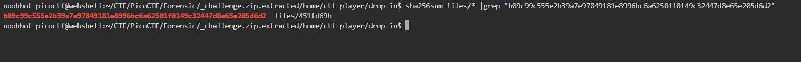
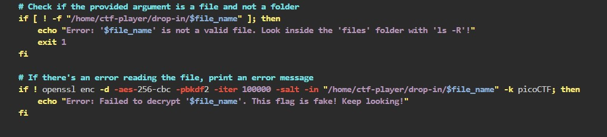
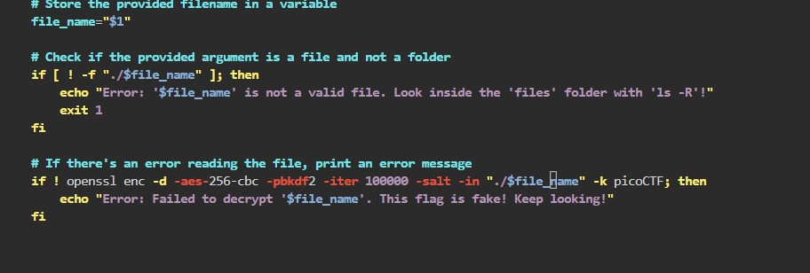
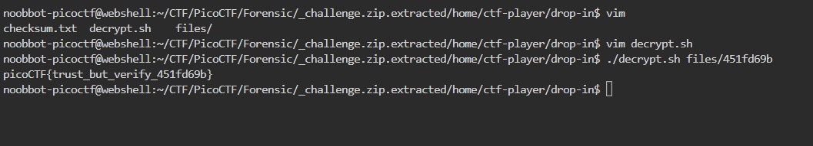

# Verify

People keep trying to trick my players with imitation flags. I want to make sure they get the real thing! I'm going to provide the SHA-256 hash and a decrypt script to help you know that my flags are legitimate.
You can download the challenge files here:
challenge.zip
Additional details will be available after launching your challenge instance.


# Hints

1. Checksums let you tell if a file is complete and from the original distributor. If the hash doesn't match, it's a different file.
2. You can create a SHA checksum of a file with sha256sum <file> or all files in a directory with sha256sum <directory>/*.
3. Remember you can pipe the output of one command to another with |. Try practicing with the 'First Grep' challenge if you're stuck!

# What I Did

After i extract the file i assume that i need to find the file
that have the same sha256 value to the sha256 value that stored in the checksum.txt and decrypt it using the 
decryptor file given (decrypt.sh).

so i use command in the list of files to get the files we are looking for

``` 
sha256sum files/* |grep "b09c99c555e2b39a7e97849181e8996bc6a62501f0149c32447d8e65e205d6d2" 
```

and we get this


files/451fd69b is the file we are looking for, we just need to decrypt it using the shell script given
using this script should be right

./decrypt.sh files/451fd69b

but it shows error and it says that its not a valid file

Its because in the decrypt.sh code it check from /home folder
but my directory tree is diffrent from the code


So i just need to change the directory to the relative directory
based on my case, it looks like this


and it gives me the flag


the flag is

``` 

picoCTF{trust_but_verify_451fd69b} 

```
