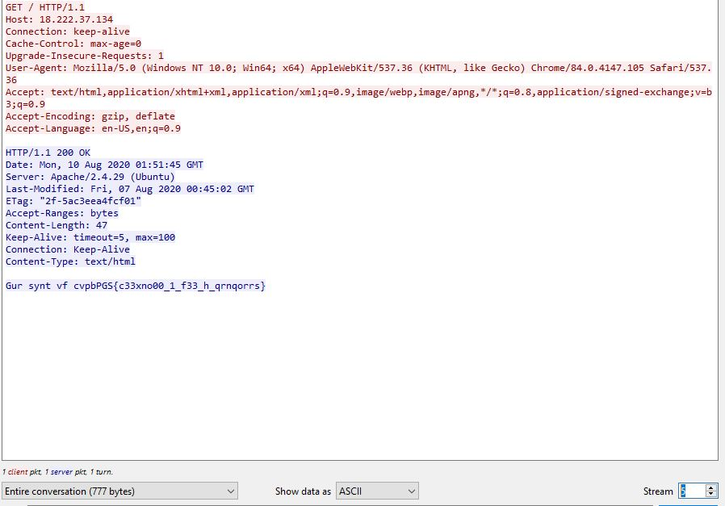
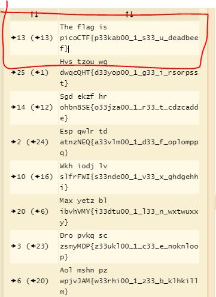

# Wireshark doo dooo do doo...

Can you find the flag? shark1.pcapng.

# Hints

no hints.

# What I Did

I download the file and open it in wireshark
i try following the stream and the in stream 5
i find this suspicious string


Gur synt vf cvpbPGS{c33xno00_1_f33_h_qrnqorrs}

I put it in caesar decoder
https://www.dcode.fr/caesar-cipher?__r=1.08ae94576cccefccc35eb9363194e30f




and i get the flag, the flag is

``` 

picoCTF{p33kab00_1_s33_u_deadbeef}

```
