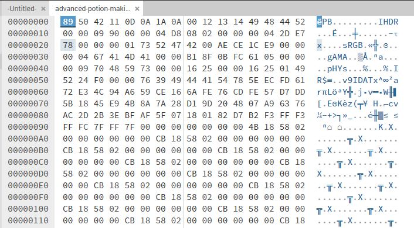
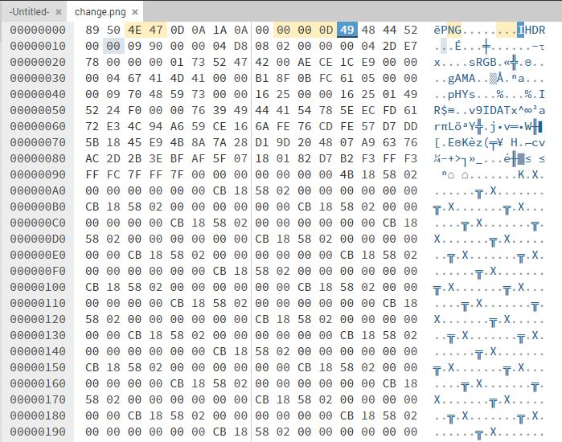
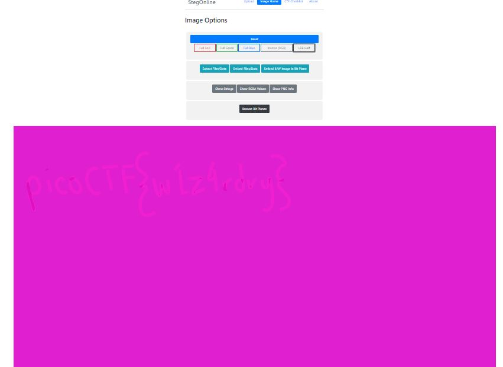

# advanced-potion-making

Ron just found his own copy of advanced potion making, but its been corrupted by some kind of spell. Help him recover it!

# Hints

no hints.

# What I Did

First thing i tried to check the file signature
and i get this result


i tried to look for file that have PB signature
but i didn't find any. But when i find by the hex
value, it shows me that the hex value of the corrupted
file looks close to PNG file

The corrupted file header
89 50 42 11 0D 0A 1A 0A

PNG file header
89 50 4E 47 0D 0A 1A 0A

then when i look deeper in this documentation

https://en.wikipedia.org/wiki/PNG

i see that IHDR is the first
chunk in PNG file. So i assume that this is a png file,
i just need to change the hex of the corrupted file to be
same like the png file. But when i downloaded the file,
the file still corrupted. In the documentation there is an example of
IHDR chunk (i believe) then i just change the hex of the corrupted file
based on the header of png file in the example.


The file works and it gives me this image 


I try to use steghanography tool in this link
https://georgeom.net/StegOnline/upload

I tried everything and when i use LSB Half it shows me the flag


and the flag is

``` 

picoCTF{w1z4rdry} 

```

