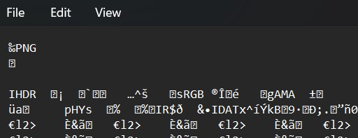

# extensions

This is a really weird text file TXT? Can you find the flag?


# Hints

1. How do operating systems know what kind of file it is? (It's not just the ending!)
2. Make sure to submit the flag as picoCTF{XXXXX}

# What I Did

Based on the file header i see that it is a PNG header file
so i need to change the file extension to png


When i open the file it shows me the flag


the flag is

``` 

picoCTF{now_you_know_about_extensions} 

```