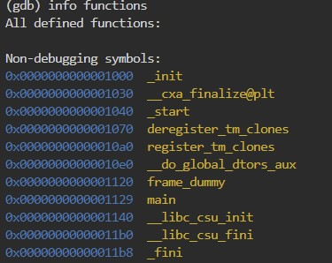
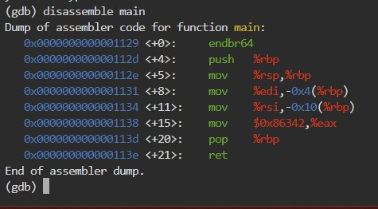

# GDB baby step 1

Can you figure out what is in the eax register at the end of the main function? Put your answer in the picoCTF flag format: picoCTF{n} where n is the contents of the eax register in the decimal number base. If the answer was 0x11 your flag would be picoCTF{17}.
Disassemble this.

# Hints

1. gdb is a very good debugger to use for this problem and many others!
2. main is actually a recognized symbol that can be used with gdb commands.

# What I Did

Based on the description of the file, i just need to dissasamble main function
and look at eax register value.

So i download the debugger in picoCTF terminal and using gdb to debug it
the i put ``` info function ``` command to get all functions
available in the program that given by the question.



then i dissasamble the main function.



based on the disassembled main we can see that the %eax is filled with  $0x86342

```
   0x0000000000001138 <+15>:    mov    $0x86342,%eax
```
then the format of the flag is picoCTF{...}
filled with the decimal value of the hexadecimal in the assembly

so the flag is
```

picoCTF{549698}

```
