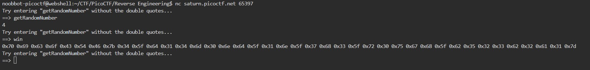
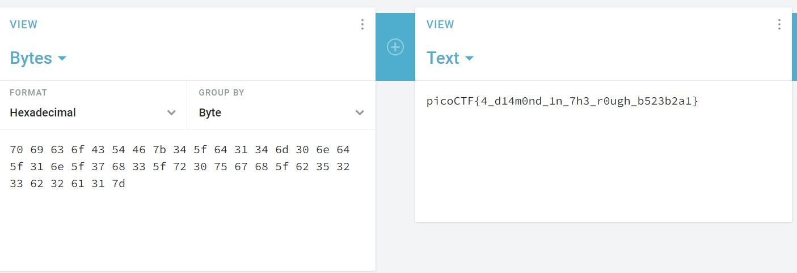

# Picker I

This service can provide you with a random number, but can it do anything else?
Connect to the program with netcat:
The program's source code can be downloaded here.

# Hints

1. Can you point the program to a function that does something useful for you?

# What I Did

Looking at the picker-1.py i see that there is a function that calls the flag
it is win() function. 

Then i try to nc the program on picoCTF terminal.
So the program basically works by the user calling the function name
as its input, so we just need to put win in the input to get the flag.



It gives me hexadecimal value i need to convert it to normal letter
by using online converter

https://cryptii.com/pipes/hex-decoder

``` 
70 69 63 6f 43 54 46 7b 34 5f 64 31 34 6d 30 6e 64 5f 31 6e 5f 37 68 33 5f 72 30 75 67 68 5f 62 35 32 33 62 32 61 31 7d 
```

after i convert it, it shows me the flag


the flag is

```

picoCTF{4_d14m0nd_1n_7h3_r0ugh_b523b2a1}

```