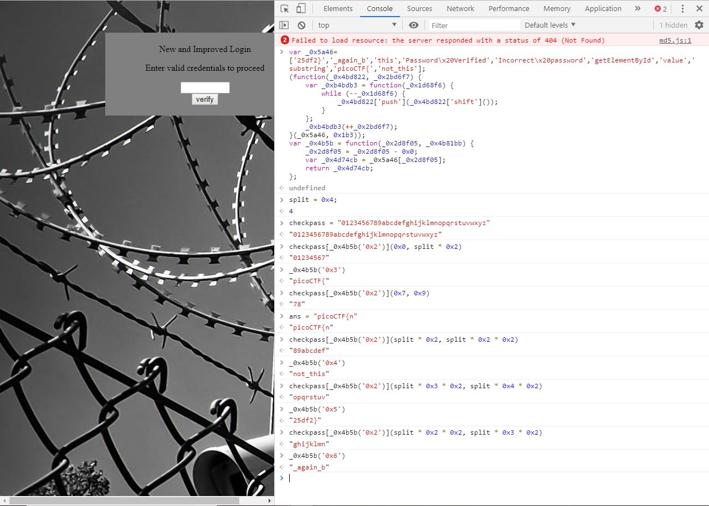

# Client-side-again
Points: 200
## Category
Web Exploitation
## Problem Statement
> Can you break into this super secure portal? `https://2019shell1.picoctf.com/problem/32255/` ([link](https://2019shell1.picoctf.com/problem/32255/)) or http://2019shell1.picoctf.com:32255
## Hints
> What is obfuscation?
## Solution
When we open this link we see another login portal. Upon viewing the page source, we find ourselves looking at a jumble of JavaScript that is obfuscated. This means that the code has been packed together an unformated to be difficult to read. We can deobfuscate it with an online tool such as this [Online JavaScript Beautifier](https://beautifier.io/). Once it is more readable, we are face with this:
```js
var _0x5a46=['25df2}','_again_b','this','Password\x20Verified','Incorrect\x20password','getElementById','value','substring','picoCTF{','not_this'];
(function(_0x4bd822, _0x2bd6f7) {
    var _0xb4bdb3 = function(_0x1d68f6) {
        while (--_0x1d68f6) {
            _0x4bd822['push'](_0x4bd822['shift']());
        }
    };
    _0xb4bdb3(++_0x2bd6f7);
}(_0x5a46, 0x1b3));
var _0x4b5b = function(_0x2d8f05, _0x4b81bb) {
    _0x2d8f05 = _0x2d8f05 - 0x0;
    var _0x4d74cb = _0x5a46[_0x2d8f05];
    return _0x4d74cb;
};

function verify() {
    checkpass = document[_0x4b5b('0x0')]('pass')[_0x4b5b('0x1')];
    split = 0x4;
    if (checkpass[_0x4b5b('0x2')](0x0, split * 0x2) == _0x4b5b('0x3')) {
        if (checkpass[_0x4b5b('0x2')](0x7, 0x9) == '{n') {
            if (checkpass[_0x4b5b('0x2')](split * 0x2, split * 0x2 * 0x2) == _0x4b5b('0x4')) {
                if (checkpass[_0x4b5b('0x2')](0x3, 0x6) == 'oCT') {
                    if (checkpass[_0x4b5b('0x2')](split * 0x3 * 0x2, split * 0x4 * 0x2) == _0x4b5b('0x5')) {
                        if (checkpass['substring'](0x6, 0xb) == 'F{not') {
                            if (checkpass[_0x4b5b('0x2')](split * 0x2 * 0x2, split * 0x3 * 0x2) == _0x4b5b('0x6')) {
                                if (checkpass[_0x4b5b('0x2')](0xc, 0x10) == _0x4b5b('0x7')) {
                                    alert(_0x4b5b('0x8'));
                                }
                            }
                        }
                    }
                }
            }
        }
    } else {
        alert(_0x4b5b('0x9'));
    }
}
```
It seems like the actual logic of the code has also been obfuscated, as there is a surplus of functions, variables, and conditions throughout this script. A simple ay to solve it is to just recreate these variables in a JavaScript console and looking at every part of the if statement in the verify function. Here, I create a fake ordered password `0123456789abcdefghijklmnopqrstuvwxyz` so that when the functions splice and check it, I can see which indices of the string are being checked and compared.

## Flag
`picoCTF{not_this_again_b25df2}`